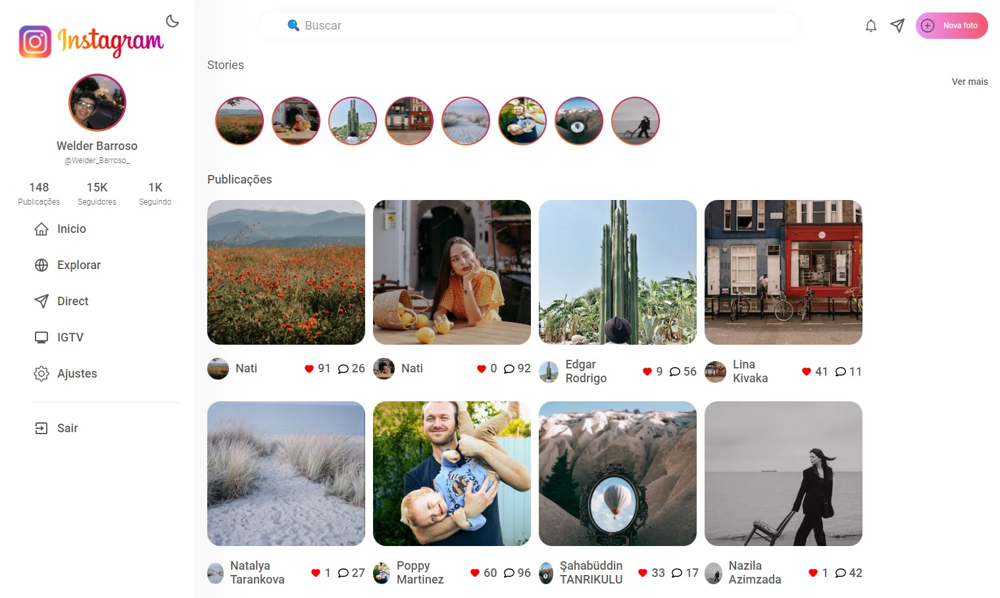

[PT-BR] · [EN](#english-version)

<div align="center">

# instagram-app

> Um clone moderno da interface do Instagram focado em transições de tema, interatividade e integração com API de fotos.


[](https://master--ubiquitous-tapioca-4da5cb.netlify.app/)

<br/>



</div>

---

## 📋 Índice

- [Sobre o Projeto](#sobre-o-projeto)
- [Tecnologias](#tecnologias)
- [Como Rodar](#como-rodar)
- [Funcionalidades](#funcionalidades)
- [Status](#status)
- [Aprendizados](#aprendizados)
- [Contato](#contato)

---

## Sobre o Projeto

Este projeto é um clone funcional da interface do Instagram, desenvolvido para explorar a manipulação de temas dinâmicos (Light/Dark mode) e o consumo de APIs REST para exibição de conteúdo visual. 

O foco foi replicar a fluidez da experiência original, garantindo que a troca de temas e a exibição de fotos ocorram de forma instantânea e agradável ao usuário.

### Funcionalidades

- [x] Alternância dinâmica entre tema Dark e Light
- [x] Exibição e ocultação interativa de imagens
- [x] Consumo real de dados via API de fotos
- [x] Layout responsivo fiel à plataforma original

---

## Tecnologias


---

## Como Rodar

### Pré-requisitos

```bash
node >= 18.0.0
npm  >= 9.0.0
```

### Instalação

```bash
# 1. Clone o repositório
git clone https://github.com/WelderBM/instagram-app.git

# 2. Acesse a pasta
cd instagram-app

# 3. Instale as dependências
npm install

# 4. Inicie o servidor de desenvolvimento
npm run dev
```

---

## Status

```
🟢 Concluído
```

**Versão atual:** 1.0.0

### Próximos passos

- [ ] Implementar sistema de likes com persistência
- [ ] Adicionar funcionalidade de busca de usuários
- [ ] Criar modal de detalhes da publicação

---

## Aprendizados

### Contexto

> Projeto desenvolvido para consolidar conhecimentos em manipulação de temas e consumo de APIs externas no ecossistema React.

### O que aprendi

- Implementação de lógica de temas utilizando variáveis CSS e contexto do React.
- Gerenciamento de efeitos colaterais com `useEffect` para chamadas de API.
- Estruturação de componentes reutilizáveis para feeds de imagem.

---

## Contato

<div align="center">

Desenvolvido por **Welder Barroso de Melo**

[](https://welderbarroso.dev)

[](https://linkedin.com/in/welder-barroso-37b654207)
[](https://github.com/WelderBM)
[](https://wa.me/5595984006377)
[](mailto:welderbarroso.dev@gmail.com)

</div>

---

<div align="center">
<sub>Feito com foco e café · <a href="https://welderbarroso.dev">welderbarroso.dev</a></sub>
</div>

---
---

<!-- ════════════════════════════════════════════
     ENGLISH VERSION
════════════════════════════════════════════ -->

<a name="english-version"></a>

[EN] · [PT-BR](#top)

<div align="center">

# instagram-app

> A modern Instagram interface clone focused on theme transitions, interactivity, and photo API integration.


[](https://master--ubiquitous-tapioca-4da5cb.netlify.app/)

</div>

---

## 📋 Table of Contents

- [About](#about)
- [Tech Stack](#tech-stack)
- [Getting Started](#getting-started)
- [Features](#features)
- [Status](#status-en)
- [Learnings](#learnings)
- [Contact](#contact-en)

---

## About

This project is a functional clone of the Instagram interface, developed to explore dynamic theme handling (Light/Dark mode) and consuming REST APIs for visual content display.

The focus was on replicating the fluidity of the original experience, ensuring that theme switching and photo rendering happen instantly and smoothly for the user.

### Features

- [x] Dynamic switching between Dark and Light themes
- [x] Interactive show/hide image logic
- [x] Real data consumption via photo API
- [x] Responsive layout faithful to the original platform

---

## Tech Stack


---

## Getting Started

### Prerequisites

```bash
node >= 18.0.0
npm  >= 9.0.0
```

### Installation

```bash
# 1. Clone the repo
git clone https://github.com/WelderBM/instagram-app.git

# 2. Enter the folder
cd instagram-app

# 3. Install dependencies
npm install

# 4. Start dev server
npm run dev
```

---

<a name="status-en"></a>

## Status

```
🟢 Completed
```

---

## Learnings

### Context

> Project developed to strengthen knowledge in theme manipulation and external API consumption within the React ecosystem.

---

<a name="contact-en"></a>

## Contact

<div align="center">

Built by **Welder Barroso de Melo**

[](https://welderbarroso.dev)

[](https://linkedin.com/in/welder-barroso-37b654207)
[](https://github.com/WelderBM)
[](https://wa.me/5595984006377)
[](mailto:welderbarroso.dev@gmail.com)

</div>

---

<div align="center">
<sub>Built with focus and coffee · <a href="https://welderbarroso.dev">welderbarroso.dev</a></sub>
</div>
