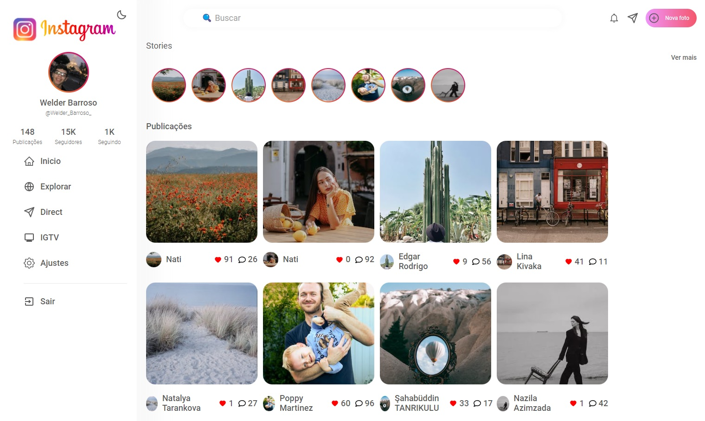

<h1 align="center">instagram-app</h1>

Um clone do Instagram
<h2 align="center"><a href="https://master--ubiquitous-tapioca-4da5cb.netlify.app/">Ver site</a></h2>

## Indice

- <a href="#funcionalidades-do-projeto">funcionalidades do projeto</a>
- <a href="#como-rodar">Como rodar este projeto</a>
- <a href="#tecnologias-ultilizadas">Tecnologias utilizadas</a>
- <a href="#pessoas-autoras">Pessoas autoras</a>
- <a href="#proximos-passos">Próximos passos</a>

<h2 id="funcionalidades-do-projeto">Funcionalidades</h2>

- [x] tema dark e white, e suas transições
- [x] mostrar e ocultar images
- [x] GET de api de fotos
<br>

<h2 id="como-rodar">Como rodar o projeto</h2>

``` bash
    # Clone este repositorio
    $ git clone linkrepo

    # Acesse a pasta do projeto no seu terminal
    $ cd instagram-app

    # Instale as dependencias
    $ npm install
    # ou
    $ yarn

    # Execute a aplicação
    $ npm run dev
    #ou
    $ yarn dev
```
<h2 id="tecnologias-ultilizadas">Tecnologias utilizadas</h2> 

1. [React](https://react.dev/)
1. [Vite](https://vitejs.dev/)


<h2 id="pessoas-autoras">Pessoas autoras</h2> 

welder barroso


<h2 id="proximos-passos">Próximos passos</h2> 

- [ ] implementar like como alterável pelo usuário
- [ ] implementar busca
